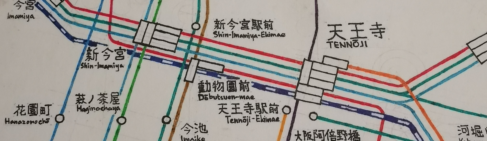

# Map of Osaka/Kyoto 22 May, 2021  

Date started: 7 Oct 2019 (draft in 2015)  
Date completed: 17 Apr 2021  
Medium: Water-based pen/marker on paper  

[Gallery](/gallery/)  

## Osaka and Kyoto
I have visited Kyoto a few times. The temples were great - I once climbed up the Fushimi-Inari Shrine with a group of friends, and it offered great views of Kyoto city, about halfway up the hill. There was an outcrop and a couple of benches you could sit on, as well as a few shops where you could buy snacks if you so fancied.  

But the thing which I remembered most were the little rivulets that would run by the small alleyways and houses in the heart of Kyoto city. The sound of water, and the sight of it carrying freshly fallen leaves from the willows planted in between, provide a really soothing experience. I would imagine that it would be an enjoyable experience to walk on it during summer.  

I have never been to Osaka, in the strictest sense. Of the four or five times I have been there, it was mainly as a hub to different places around West Honshu (enabled mostly by the generous usage of the JR Pass). I spent one night around Tennoji with a bunch of friends during my university graduation trip of 2018. We ate at this place where they served jumbo sizes of everything. The next day, an incredibly strong typhoon passed by Osaka, and we spent nine hours hunkering down in a karaoke box and singing our hearts out. It was an enjoyable and memorable experience.  

Both Osaka and Kyoto were where I first visited large station buildings. Until then, it had not occurred to me that railway stations could be landmarks of their own. The tall chasm of the Kyoto station building, which looked deceptively light given its glass facade, and the cavernous multistoreyed roof of Osaka station, astounded me. It was a breathtaking experience - a very different kind of amazement compared to the general hubbub and complexity of Tokyo and Shinjuku. I felt like I was in a cathedral for railways.  

<mini-gallery 
    photo-list= "osakyo/osakyo-06;osakyo/osakyo-11;osakyo/osakyo-99"
    layout-list="1/1,1/1;        2/1,1/1;         1/2,2/2"/>  

## The Map
The network between Osaka and Kyoto projects a much clearer separation of the railway networks between the two cities, as compared to the megalopolis of the Greater Tokyo Area. I hence had a very refreshing time drawing this map. The fact that there were two centres of focus which had to fit comfortably within the confines of my canvas, offered a new challenge in the planning of the layout. As compared to the previous map of Tokyo, many more guides were drawn - in fact, for this map, all of the drawn lines had a guide underneath.  

I experimented with a 15&deg; constraint, which provided me with a far more flexible layout than the 45&deg; constraints I was used to, but where possible, I kept the angles to 30&deg;/45&deg; multiples, to prevent the map from looking too messy. I think that the overall result was a pretty good balance of having a structured grid locally, whilst not being too stubborn on a global scale. I will continue to adopt this in my next map.  

This was also my first attempt at applying a more standard typeface for labelling. The stations were written more-or-less in a natural style, although grids were applied for virtually all labels, to maintain consistency in size. For line names, I drew the text bigger, emboldened it, and added serifs as I saw fit. I referred to sample text generators for the Meiryo font, but after a while I grew tired and figured I had gotten the general gist of when to make the strokes thicker and when not to, so I eventually did those by gut feeling too.  

I wanted to apply this style to major stations also, but somewhere along the way I forgot, so I'm eager to try this out for the next map.  

Another first - I used curves instead of kinks for all my lines. I liked the effect, and it especially helped to detangle complicated junctions (especially after Tennoji). But this was a much more painstaking endeavour than simply connecting straight lines together, as each bend and corner required the prior placement of guide circles. Nevertheless, it was well worth it. I still like the computerish, PCU board-like style of the 45&deg; kinks in my Tokyo map though.

For through-services, I used smaller station markers and thinner lines (single- instead of double-width) to denote them. But I was not very disciplined in this - I was playing around with the idea, trying out different station markers, while drawing the Karasuma Line down Kintetsu Kyoto Line, and by that time, most of the lines on the Hankyu side had already been drawn, so there wasn't any space to draw any lines beyond Takatsuki.  

I also misestimated the position of Nara station and had to draw a pretty steep line from Ikoma to the eastern side of Osaka.  

And as with most attempts, there are mistakes here and there - nothing which would severly impact the accurate interpretation of the map, however.

[Click here to see photos of the map.](/gallery/)