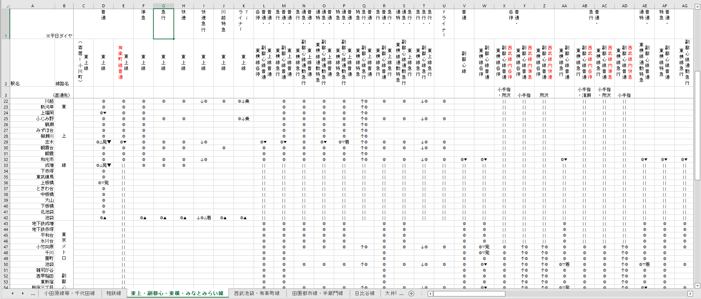

# Map of Tokyo (8th revision) - Update 9 January, 2022

I did say it was going to be from time to time... about half a year has passed since my last upload. Happy New Year, and hopefully we get to see the beginning of the end to this pandemic. And I get to go to Tokyo...

What have I been doing for the past half a year? Well, I've been slowly researching on my new, eighth rendition of the Tokyo railway map.

The map is inspired by [this twitter post by ViMCooMa Project](https://twitter.com/vimcoomaproject/status/1267056820096348160), which shows the JR East railway map for the Greater Tokyo Area &mdash; but for services, not just lines. In other words, each line on the map doesn't represent one line on the system, but rather a type of service. This is an important distinction to make, because, whereas "line" and "service" may be usually synonymous for most transit systems in the world, it is not for certain systems, and Tokyo happens to be one of them. Different types of services, each with their own stopping patterns, can belong to the same line, often stopping at the same platforms in stations.

The history of introducing express service trains alongside regular services in Japan can be traced back to 1882, where [an Express train ran on the first railway line in Japan](https://news.mynavi.jp/article/trivia-75/), plying between Shimbashi and Yokohama (now Sakuragicho) Stations, and stopping only at Shinagawa and Kanagawa on the way &mdash; so for almost as long as passenger railways themselves have existed in Japan. Since then, many different kinds of services have been assigned and used by various companies; here are a list of some of them:

- Rapid Limited Express (快速特急・快特)
- Limited Express (特別急行・特急)
- Commuter Limited Express (通勤特急・通特)
- Semi Limited Express (準特急)
- Special Rapid (特別快速・特快)
- Rapid Express (快速急行・快急)
- Express (急行)
- Commuter Express (通勤急行・通急)
- Semi Express (準急行・準急)
- Commuter Semi Express (通勤準急)
- Commuter Rapid (通勤快速)
- Rapid (快速)
- Local/All-stops (普通・各停)

* The English labels are approximates, and they are not always used officially in the companies which use them. Different companies use a different selection of these service labels for their trains &mdash; no company uses all the labels.

As you may notice, there is a certain heirarchy &mdash; there's Rapid (快速), Express (急行), and Limited Express (特急), and by adding different kinds of suffixes and modifiers, the supposed speed of the service (not only operating speed, but also the sparseness of stopping patterns, and the determining of which train passes which) increases or decreases. But the ordering is not definite: for some companies, the Commuter (通勤) versions of their base counterparts are quicker and stop at fewer stops, while for others, they are slower and stop at more stops.

In particular, the Rapid service (快速) can carry vastly different meanings from company to company; in JR, it is the second-slowest service, only quicker than Local, but in Tobu it is placed above Express. Oh, and don't forget it can also be a modifier (as in Rapid Limited Express).

All in all, this makes for a pretty confusing boarding exprience for first-timers, and it is no wonder that travelling by subway or train in Tokyo can be a pretty daunting task. But on the other hand, it can make for a more efficient experience for commuters &mdash; travellers from further away can take more express services to get to the city faster, while travellers closer to the city can enjoy a less crowded &mdash; albeit slower &mdash; train, with passengers upstream having already been channelled to the express services.

It is this amazing complexity which I have always wished to incorporate into my railway maps of Japan, and in any railway map overall, should such services exist. The twitter post by ViMCooMa has only further invigorated my desire to do so. But not only for JR &mdash; I want to do one of all the railway companies in Tokyo.

## Timetables, stopping patterns and terminal stations
To do that, I first needed to find out what the different stopping patterns were for each line. Thus the past six months have been dedicated to some research over at the Japanese Wikipedia &mdash; kudos to the editors who have kept it up to date and provided detailed depictions of the different services and their stopping patterns, even up to differences between them running during morning/evening rush hours and weekends.

I used excel to record down these services, and somewhere along the way I thought it would be a good idea to also record down the terminal stations of those services (i.e. where do these services start and terminate. For a particular type of service, some trains may run only a portion of the service.) This is when Wikipedia was not enough for me, and I had to start looking through timetable websites like [Ekitan](https://ekitan.com/) to check where the services started and ended. For some through-services, the service type can change between lines, so there was little choice but to look through each and every train for those services. It was a gruelling endeavour, but one which I can certainly say paid off &mdash; not least because I learnt a lot more about the services and stopping patterns than I already knew before it. Here's a peek at the Tobu Tojo Line/Fukutoshin Line System:

The idea is to use this excel spreadsheet to create line- or section- based "test maplets" of what I envision to be particularly difficult or complex parts of the map. That will take another half a year, perhaps.

## Morning and evening, weekday and weekend
One of the things I learnt when I did this research was that some services with specialised stopping patterns operated only during morning or evening peak periods, and some operated during weekdays but not during weekends (or vice versa). Perhaps in future renditions I will make multiple versions of the map: one for morning peak, one for evening peak, one for weekends,... and so on.
