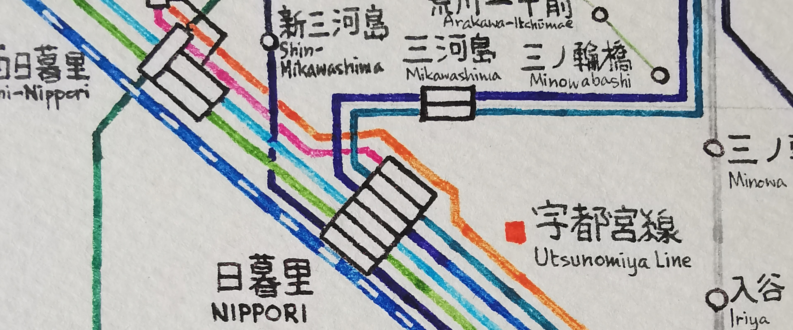

# Map of Tokyo 12 June, 2021

Date started: Oct 2012  
Date completed: 31 Dec 2012  
Medium: Water-based pen on paper  

[Gallery](/gallery/#Tokyo_Map)

## The Map  
Tokyo is the first map I seriously attempted to copy, and later draw. I can't remember exactly when, but it was after my first trip to Tokyo with family in 2004, when I was 10. I do remember getting enthralled by the utter complexity that the map in the tourist guidebook we brought along had to offer. I had never seen so many colors on a transit map before in my life. But even then, I noticed that some lines were of the same color, which led to confusion about which line was which - and worse, where the lines went when two of them crossed. (I would later find out that there was one color for all the "minor" JR Lines, and one color for all private railways. Only the subway had their own lines.) So I went about copying the guidebook version, drawing the lines as unambiguously as I could. I didn't use color then; I only had a ball-point pen and some lined paper lying around, which I would glue together when the map got too big.

Over the years, I would re-draw the map I had copied, making revisions and attempting to expand beyond the area the guidebook covered. 2012 was a particularly good year, because I started to reference Google Maps for the actual alignment of the lines, and so I wasn't bound by other maps which I referenced. By the end of 2012, I had completed a draft on lined paper, and bought a set of colored gel pens that I used to copy to a large sheet of drawing paper which I had purchased from an art store. That map formed the predecessor to the map here.  

As far as I know, this map is the seventh revision to the first map I drew. (I'll post some pictures of maps of the other revisions sometime in the future.)  

The general idea behind the Tokyo map, as is with most unofficial ones, is to make one that encompasses all the companies. There are two subway operators, a (privatised) national operator, seven major private railway operators, and dozens of minor ones. Each company has their own map, but usually prioritises only their lines (and through-service lines; other lines which they continue to run into) on the map, relegating other lines to thin, grey ones on the map. I wanted one which had all of them.  

For this map, each line gets its own color, except for Shinkansen lines, which all share the same colour. The colours are as close as the official line colours I could get with the 16-colour set of pens. The Shonan-Shinjuku Line gets two colours.  

Each line is drawn "double-width": they are not drawn with a thick pen, but rather a line is drawn, and then another is drawn immediately next to it. I liked the idea of "hand-drawn straight lines" - they were straight, but not as if you had used a ruler to draw them: there are places where the line shifts and bends just enough to see that a person had drawn it, rather than having it printed. But using only single-width lines made the shifts and bends stand out just a little too much - the double-width lines helped to mitigate that.  

I did not use a ruler to draw any of the lines. I did prop a few perpendicular guide lines using a pencil, but apart from it everything was calibrated by eyeballing only. The horizontal and vertical lines I think were okay, but the slope of the 45&deg; lines differ quite a bit from segment to segment.  

There were several mistakes made, which were later patched up. You might be able to see the locations which I cut and replaced the part where I had made an error - see if you can find them all!  
